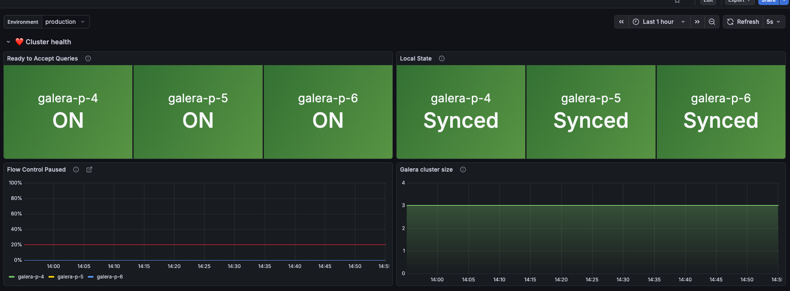
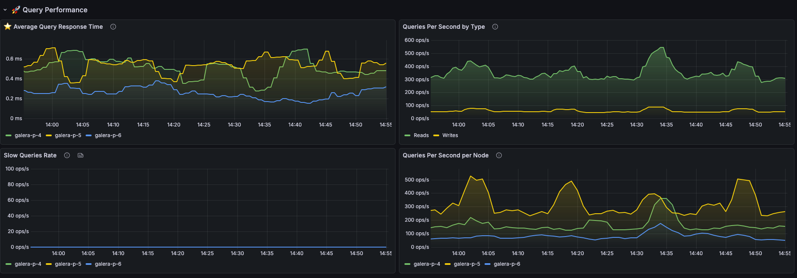
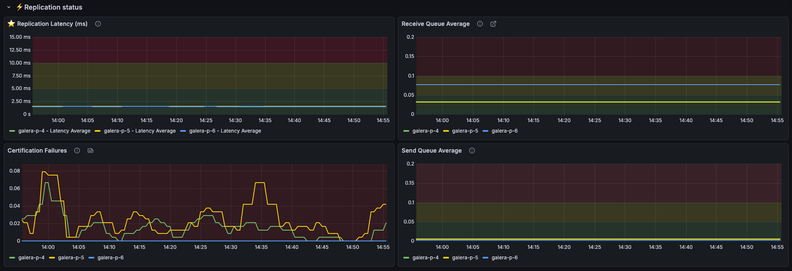
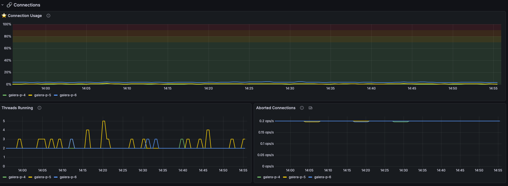
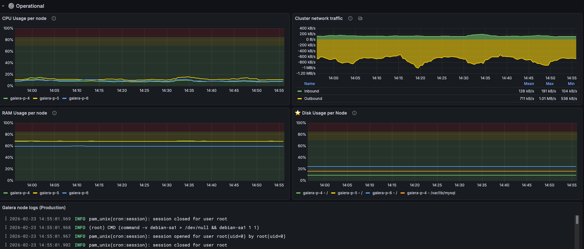

# Galera Cluster Grafana Dashboard

A comprehensive Grafana dashboard for monitoring MariaDB Galera clusters in production. Focuses on cluster health, replication performance, query metrics, and resource utilization.

## Features

- Cluster membership and node state at a glance
- Galera replication monitoring (flow control, queue depths, certification failures, latency)
- Query performance tracking (QPS by type, response time, slow queries)
- Connection saturation and thread activity
- Per-node CPU, RAM, and disk usage
- Optional log panel (Loki)

## Prerequisites

- **MariaDB** with Galera cluster (tested on MariaDB 10.11)
- **Grafana** 11+
- **Prometheus** as a configured datasource
- **mysqld_exporter** ([prometheus/mysqld_exporter](https://github.com/prometheus/mysqld_exporter)) with `--collect.global_status` enabled
- **node_exporter** ([prometheus/node_exporter](https://github.com/prometheus/node_exporter)) for CPU, RAM, and disk panels
- **Loki** (optional, for the log panel)

## Installation

1. In Grafana, go to **Dashboards → Import → Upload JSON file**
2. Select `dashboard.json`
3. Choose your Prometheus datasource
4. Save

## Configuration

### Template Variables

The dashboard uses a single template variable:

| Variable       | Description                                                    |
| -------------- | -------------------------------------------------------------- |
| `$environment` | Filters all queries by the `environment` label on your metrics |

Make sure your mysqld_exporter and node_exporter targets include an `environment` label that matches your setup.

### Things You Will Need to Adjust

**Instance labels** — The dashboard uses the `instance` label to identify nodes. Verify that your mysqld_exporter and node_exporter metrics use consistent, readable instance labels (e.g., `galera-p-4`, `galera-p-5`). If your labels differ, update the legend and queries accordingly.

**CPU/RAM/Disk panels** — The resource panels in the collapsed "Resources" row contain hardcoded instance name patterns and filesystem mount points specific to the original environment. You will need to update:
- The `instance` label regex to match your node hostnames
- The `mountpoint` value in disk queries to match your MySQL data partition (e.g., `/data`, `/var/lib/mysql`)
- The `fstype` exclusions if your setup differs

**Log panel (optional)** — The dashboard includes an optional Loki log panel. The query is environment-specific and will need to be rewritten for your setup. If you don't use Loki, remove or disable this panel.

## Required Metrics

Verify your exporters are producing these metrics before importing.

### Galera / wsrep Metrics (from mysqld_exporter)

| Metric                                           | Used For                                |
| ------------------------------------------------ | --------------------------------------- |
| `mysql_global_status_wsrep_ready`                | Node accepting queries (1 = yes)        |
| `mysql_global_status_wsrep_local_state`          | Node state (4 = Synced)                 |
| `mysql_global_status_wsrep_cluster_size`         | Number of nodes in cluster              |
| `mysql_global_status_wsrep_flow_control_paused`  | Fraction of time paused by flow control |
| `mysql_global_status_wsrep_local_recv_queue_avg` | Avg writesets waiting to be applied     |
| `mysql_global_status_wsrep_local_send_queue_avg` | Avg writesets waiting to be sent        |
| `mysql_global_status_wsrep_local_cert_failures`  | Transaction certification failures      |
| `mysql_galera_evs_repl_latency_avg_seconds`      | Replication latency between nodes       |

### MySQL Metrics (from mysqld_exporter)

| Metric                                                | Used For                                             |
| ----------------------------------------------------- | ---------------------------------------------------- |
| `mysql_global_status_commands_total`                  | QPS by command type (select, insert, update, delete) |
| `mysql_global_status_slow_queries`                    | Slow query rate                                      |
| `mysql_global_status_threads_connected`               | Current connections                                  |
| `mysql_global_status_threads_running`                 | Actively executing threads                           |
| `mysql_global_variables_max_connections`              | Connection limit (for saturation %)                  |
| `mysql_global_status_aborted_connects`                | Failed connection attempts                           |
| `mysql_info_schema_query_response_time_seconds_sum`   | Query response time (numerator)                      |
| `mysql_info_schema_query_response_time_seconds_count` | Query response time (denominator)                    |

### Node Metrics (from node_exporter)

| Metric                           | Used For   |
| -------------------------------- | ---------- |
| `node_cpu_seconds_total`         | CPU usage  |
| `node_memory_MemAvailable_bytes` | RAM usage  |
| `node_memory_MemTotal_bytes`     | RAM usage  |
| `node_filesystem_avail_bytes`    | Disk usage |
| `node_filesystem_size_bytes`     | Disk usage |

## Dashboard Layout

| Row               | Contents                                                      |
| ----------------- | ------------------------------------------------------------- |
| Cluster Health    | Ready status, local state, cluster size, flow control         |
| Replication       | Receive queue, send queue, cert failures, replication latency |
| Query Performance | QPS by type, QPS per node, response time, slow queries        |
| Connections       | Connection usage %, aborted connections, threads running      |
| Operational       | CPU, RAM, disk usage per node, network traffic, logs          |

## Tips

- **Shared crosshair** is enabled so hovering on one panel shows the timestamp across all panels for easy correlation.
- All time series panels use **threshold regions** to visually indicate healthy (green), warning (yellow), and critical (red) zones.

## Contributing

Issues and pull requests are welcome. If you've tested this on a different MariaDB/MySQL version or exporter configuration, please open an issue or PR to expand compatibility notes.

## License

Apache 2.0 License. See [LICENSE](LICENSE) for details.
